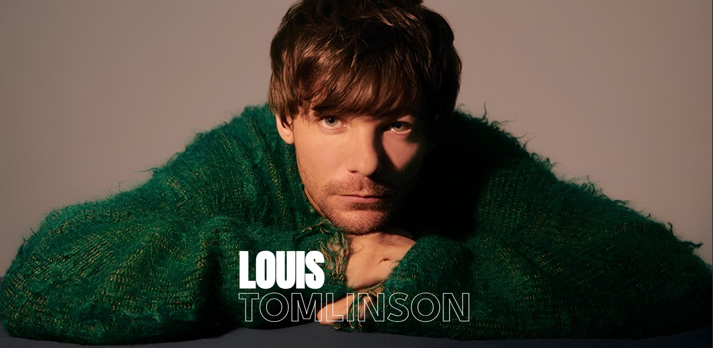

# Louis Tomlinson 

Projeto de uma **landing page** inspirada no cantor *Louis Tomlinson*. A proposta é criar uma experiência visual moderna e responsiva, destacando elementos gráficos e informações de conteúdo relacionados ao artista e seu trabalho.

## Preview

## Funcionalidades

- Design responsivo com CSS customizado
- Cards com os albuns e clipes musicais
- Layout otimizado para mobile e desktop
- Paleta de cores personalizada baseada na estética do cantor

## Tecnologias utilizadas

- [React.js](https://reactjs.org/)
- [Vite](https://vitejs.dev/)
- HTML5 + CSS3 (customizados, sem frameworks)
- JavaScript (ES6+)

## Instalação

1 - Clone o projeto:

`git clone https://github.com/Nicole260205/louis-tomlinson-landingpage.git`  

2 - Acesse a pasta:

`cd louis-tomlinson-landingpage`  

3 - Instale as dependências:

`npm install`

4 - Execute localmente:

`npm run dev`

Acesse: http://localhost:5173

## Estrutura
📦 louis-tomlinson-landingpage  
 ┣ 📂components 
 ┣ 📂pages 
 ┣ 📂assets 
 ┣ App.jsx 
 ┣ main.jsx 
 ┣ index.css 
 ┗ vite.config.js 

## Autora
Feito por @Nicole260205
